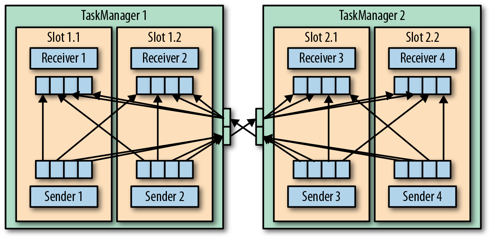
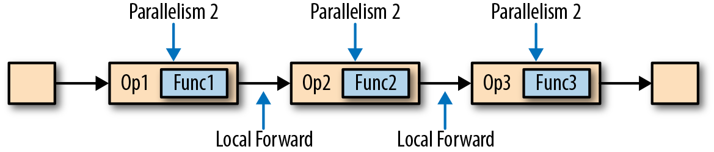
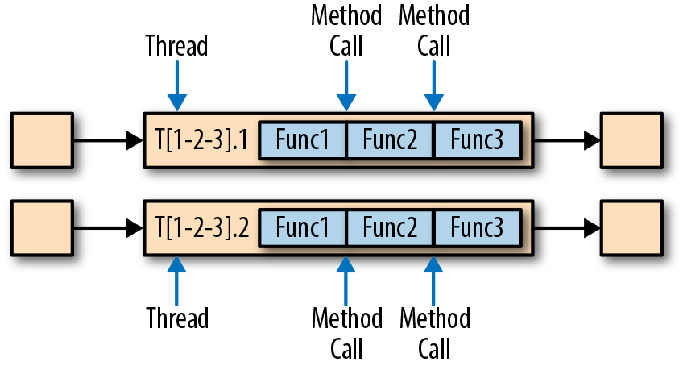
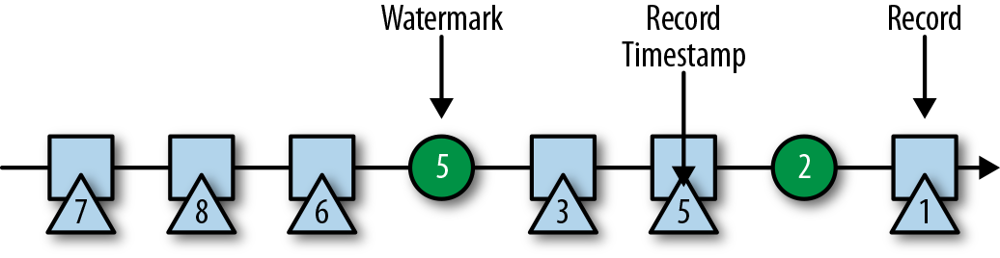

<!-- markdownlint-disable -->
# Stream processing with apache Flink

## Chapter 3. The Architecture of Apache Flink

### System Architecture

Common challenges that distributed systems
* allocation and management of compute resources in a cluster, 
* process coordination, 
* durable and highly available data storage, 
* failure recovery

Flink does not implement all this functionality by itself. Instead, it focuses on its core function—distributed data stream processing—and leverages existing cluster infrastructure and services. 
* Flink is well integrated with cluster resource managers, such as Apache Mesos, YARN, and Kubernetes, but can also be configured to run as a stand-alone cluster. 
* Flink does not provide durable, distributed storage. Instead, it takes advantage of distributed filesystems like HDFS or object stores such as S3. 
* For leader election in highly available setups, Flink depends on Apache ZooKeeper.

### Components of a Flink Setup

* **JobManager:** 
    * The **JobManager** is the master process that controls the execution of a single application
    * The application consists of   
        * JobGraph (a logical dataflow graph) 
        * JAR file that bundles all the required classes, libraries, and other resources. 
    * The JobManager converts the JobGraph into a physical dataflow graph called the **ExecutionGraph**, which consists of tasks that can be executed in parallel. 
    * The JobManager requests the necessary resources (TaskManager slots) to execute the tasks from the ResourceManager. Once it receives enough TaskManager slots, it distributes the tasks of the ExecutionGraph to the TaskManagers that execute them. 
    * During execution, the JobManager is responsible for all actions that require a central coordination such as the coordination of checkpoints

* **ResourceManagers:** 
    * Flink features multiple **ResourceManagers** for different environments and resource providers such as YARN, Mesos, Kubernetes, and standalone deployments

* **TaskManager**
* **Dispatcher** 

Figure 3-1. Application submission and component interactions

### Data Transfer in Flink
*  The TaskManagers take care of shipping data from sending tasks to receiving tasks.
*  The network component of a TaskManager collects records in buffers before they are shipped, i.e., records are not shipped one by one but batched into buffers
* Each TaskManager has a pool of network buffers (by default 32 KB in size) to send and receive data.
* Streaming applications need to exchange data in a pipelined fashion—each pair of TaskManagers maintains a permanent TCP connection to exchange data

Figure 3-4. Data transfer between TaskManagers

* As shown in Figure 3-4, each of the four sender tasks needs at least four network buffers to send data to each of the receiver tasks and each receiver task requires at least four buffers to receive data.
* Flink features different techniques to reduce the communication costs between tasks.

### Credit-Based Flow Control
* Buffering is needed to fully utilize the bandwidth of network connections. 
* In the context of stream processing, one disadvantage of buffering is that it adds latency because records are collected in a buffer instead of being immediately shipped.
* A receiving task grants some credit to a sending task, the number of network buffers that are reserved to receive its data. 
* Once a sender receives a credit notification, it ships as many buffers as it was granted and the size of its backlog—the number of network buffers that are filled and ready to be shipped. 
* The receiver processes the shipped data with the reserved buffers and uses the sender’s backlog size to prioritize the next credit grants for all its connected senders.

**Advantages**
 * reduces latency because senders can ship data as soon as the receiver has enough resources to accept it 
 * effective mechanism to distribute network resources in the case of skewed data distributions because credit is granted based on the size of the senders’ backlog.

### Task Chaining

Figure 3-5. An operator pipeline that complies with the requirements of task chaining

* two or more operators must be configured with the same parallelism * connected by local forward channels.

Figure 3-6. Chained task execution with fused functions in a single thread and data passing via method calls

* The functions of the operators are fused into a single task that is executed by a single thread. 
* Records that are produced by a function are separately handed over to the next function with a simple method call. 
* Hence, there are basically no serialization and communication costs for passing records between functions.
* Task chaining can significantly reduce the communication costs between local tasks, but there are also cases when it makes sense to execute a pipeline without chaining. For example, it can make sense to break a long pipeline of chained tasks or break a chain into two tasks to schedule an expensive function to different slots.

### Event-Time Processing

While processing time is easy to understand because it is based on the local time of the processing machine, it produces somewhat arbitrary, inconsistent, and nonreproducible results. In contrast, event-time semantics yield reproducible and consistent results, which is a hard requirement for many stream processing use cases

**Timestamps**

All records that are processed by a Flink event-time streaming application must be accompanied by a timestamp. The timestamp associates a record with a specific point in time, usually the point in time at which the event that is represented by the record happened

**Watermarks**

In addition to record timestamps, a Flink event-time application must also provide watermarks. Watermarks are used to derive the current event time at each task in an event-time application. Time-based operators use this time to trigger computations and make progress. For example, a time-window task finalizes a window computation and emits the result when the task event-time passes the window’s end boundary.

Watermarks have two basic properties:

1. They must be monotonically increasing to ensure the event-time clocks of tasks are progressing and not going backward.
2. They are related to record timestamps. A watermark with a timestamp T indicates that all subsequent records should have timestamps > T.

When a task receives a record that violates the watermark property and has smaller timestamps than a previously received watermark, it may be that the computation it belongs to has already been completed. Such records are called late records

An interesting property of watermarks is that they allow an application to control result completeness and latency. Watermarks that are very tight—close to the record timestamps—result in low processing latency because a task will only briefly wait for more records to arrive before finalizing a computation. At the same time, the result completeness might suffer because relevant records might not be included in the result and would be considered as late records. Inversely, very conservative watermarks increase processing latency but improve result completeness.

**Watermark Propagation and Event Time**