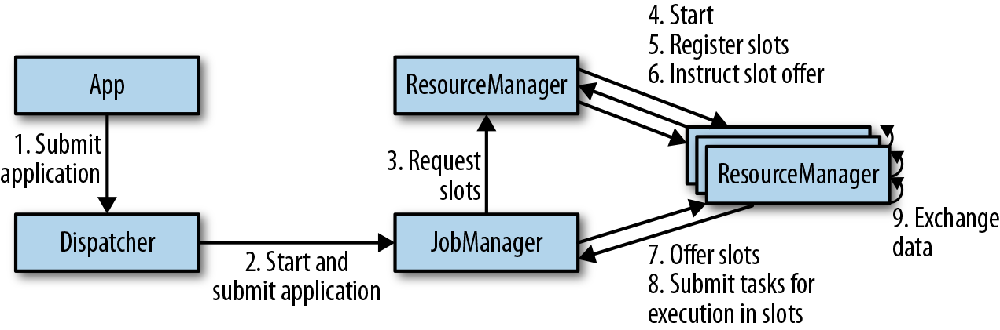

<!-- markdownlint-disable -->
# Stream processing with apache Flink

## Chapter 3. The Architecture of Apache Flink

### System Architecture

Common challenges that distributed systems
* allocation and management of compute resources in a cluster, 
* process coordination, 
* durable and highly available data storage, 
* failure recovery

Flink does not implement all this functionality by itself. Instead, it focuses on its core function—distributed data stream processing—and leverages existing cluster infrastructure and services. 
* Flink is well integrated with cluster resource managers, such as Apache Mesos, YARN, and Kubernetes, but can also be configured to run as a stand-alone cluster. 
* Flink does not provide durable, distributed storage. Instead, it takes advantage of distributed filesystems like HDFS or object stores such as S3. 
* For leader election in highly available setups, Flink depends on Apache ZooKeeper.

### Components of a Flink Setup

* **JobManager:** 
    * The **JobManager** is the master process that controls the execution of a single application
    * The application consists of   
        * JobGraph (a logical dataflow graph) 
        * JAR file that bundles all the required classes, libraries, and other resources. 
    * The JobManager converts the JobGraph into a physical dataflow graph called the **ExecutionGraph**, which consists of tasks that can be executed in parallel. 
    * The JobManager requests the necessary resources (TaskManager slots) to execute the tasks from the ResourceManager. Once it receives enough TaskManager slots, it distributes the tasks of the ExecutionGraph to the TaskManagers that execute them. 
    * During execution, the JobManager is responsible for all actions that require a central coordination such as the coordination of checkpoints

* **ResourceManagers:** 
    * Flink features multiple **ResourceManagers** for different environments and resource providers such as YARN, Mesos, Kubernetes, and standalone deployments

* **TaskManager**
* **Dispatcher** 

Figure 3-1. Application submission and component interactions

