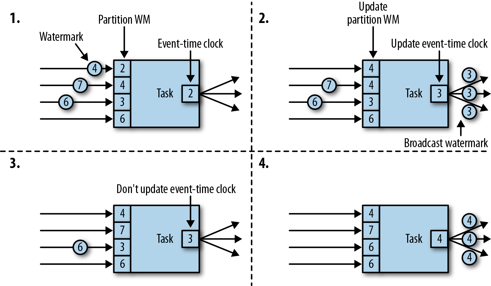

<!-- markdownlint-disable -->
# Stream processing with apache Flink

## Chapter 3. The Architecture of Apache Flink

### System Architecture

Common challenges that distributed systems
* allocation and management of compute resources in a cluster, 
* process coordination, 
* durable and highly available data storage, 
* failure recovery

Flink does not implement all this functionality by itself. Instead, it focuses on its core function—distributed data stream processing—and leverages existing cluster infrastructure and services. 
* Flink is well integrated with cluster resource managers, such as Apache Mesos, YARN, and Kubernetes, but can also be configured to run as a stand-alone cluster. 
* Flink does not provide durable, distributed storage. Instead, it takes advantage of distributed filesystems like HDFS or object stores such as S3. 
* For leader election in highly available setups, Flink depends on Apache ZooKeeper.

### Components of a Flink Setup

* **JobManager:** 
    * The **JobManager** is the master process that controls the execution of a single application
    * The application consists of   
        * JobGraph (a logical dataflow graph) 
        * JAR file that bundles all the required classes, libraries, and other resources. 
    * The JobManager converts the JobGraph into a physical dataflow graph called the **ExecutionGraph**, which consists of tasks that can be executed in parallel. 
    * The JobManager requests the necessary resources (TaskManager slots) to execute the tasks from the ResourceManager. Once it receives enough TaskManager slots, it distributes the tasks of the ExecutionGraph to the TaskManagers that execute them. 
    * During execution, the JobManager is responsible for all actions that require a central coordination such as the coordination of checkpoints

* **ResourceManagers:** 
    * Flink features multiple **ResourceManagers** for different environments and resource providers such as YARN, Mesos, Kubernetes, and standalone deployments

* **TaskManager**
* **Dispatcher** 

Figure 3-1. Application submission and component interactions

### Data Transfer in Flink
*  The TaskManagers take care of shipping data from sending tasks to receiving tasks.
*  The network component of a TaskManager collects records in buffers before they are shipped, i.e., records are not shipped one by one but batched into buffers
* Each TaskManager has a pool of network buffers (by default 32 KB in size) to send and receive data.
* Streaming applications need to exchange data in a pipelined fashion—each pair of TaskManagers maintains a permanent TCP connection to exchange data

Figure 3-4. Data transfer between TaskManagers

* As shown in Figure 3-4, each of the four sender tasks needs at least four network buffers to send data to each of the receiver tasks and each receiver task requires at least four buffers to receive data.
* Flink features different techniques to reduce the communication costs between tasks.

### Credit-Based Flow Control
* Buffering is needed to fully utilize the bandwidth of network connections. 
* In the context of stream processing, one disadvantage of buffering is that it adds latency because records are collected in a buffer instead of being immediately shipped.
* A receiving task grants some credit to a sending task, the number of network buffers that are reserved to receive its data. 
* Once a sender receives a credit notification, it ships as many buffers as it was granted and the size of its backlog—the number of network buffers that are filled and ready to be shipped. 
* The receiver processes the shipped data with the reserved buffers and uses the sender’s backlog size to prioritize the next credit grants for all its connected senders.

**Advantages**
 * reduces latency because senders can ship data as soon as the receiver has enough resources to accept it 
 * effective mechanism to distribute network resources in the case of skewed data distributions because credit is granted based on the size of the senders’ backlog.

### Task Chaining

Figure 3-5. An operator pipeline that complies with the requirements of task chaining

* two or more operators must be configured with the same parallelism * connected by local forward channels.

Figure 3-6. Chained task execution with fused functions in a single thread and data passing via method calls

* The functions of the operators are fused into a single task that is executed by a single thread. 
* Records that are produced by a function are separately handed over to the next function with a simple method call. 
* Hence, there are basically no serialization and communication costs for passing records between functions.
* Task chaining can significantly reduce the communication costs between local tasks, but there are also cases when it makes sense to execute a pipeline without chaining. For example, it can make sense to break a long pipeline of chained tasks or break a chain into two tasks to schedule an expensive function to different slots.

### Event-Time Processing

While processing time is easy to understand because it is based on the local time of the processing machine, it produces somewhat arbitrary, inconsistent, and nonreproducible results. In contrast, event-time semantics yield reproducible and consistent results, which is a hard requirement for many stream processing use cases

**Timestamps**

All records that are processed by a Flink event-time streaming application must be accompanied by a timestamp. The timestamp associates a record with a specific point in time, usually the point in time at which the event that is represented by the record happened

**Watermarks**

In addition to record timestamps, a Flink event-time application must also provide watermarks. Watermarks are used to derive the current event time at each task in an event-time application. Time-based operators use this time to trigger computations and make progress. For example, a time-window task finalizes a window computation and emits the result when the task event-time passes the window’s end boundary.

Watermarks have two basic properties:

1. They must be monotonically increasing to ensure the event-time clocks of tasks are progressing and not going backward.
2. They are related to record timestamps. A watermark with a timestamp T indicates that all subsequent records should have timestamps > T.

When a task receives a record that violates the watermark property and has smaller timestamps than a previously received watermark, it may be that the computation it belongs to has already been completed. Such records are called late records

An interesting property of watermarks is that they allow an application to control result completeness and latency. Watermarks that are very tight—close to the record timestamps—result in low processing latency because a task will only briefly wait for more records to arrive before finalizing a computation. At the same time, the result completeness might suffer because relevant records might not be included in the result and would be considered as late records. Inversely, very conservative watermarks increase processing latency but improve result completeness.

**Watermark Propagation and Event Time**

Tasks can register timers at the timer service to perform a computation at a specific point in time in the future. For example, a window operator registers a timer for every active window, which cleans up the window’s state when the event time passes the window’s ending time

When a task receives a watermark, the following actions take place:

1. The task updates its internal event-time clock based on the watermark’s timestamp.
2. The task’s time service identifies all timers with a time smaller than the updated event time. For each expired timer, the task invokes a callback function that can perform a computation and emit records.
3. The task emits a watermark with the updated event time.

A task maintains a partition watermark for each input partition. When it receives a watermark from a partition, it updates the respective partition watermark to be the maximum of the received value and the current value. Subsequently, the task updates its event-time clock to be the minimum of all partition watermarks. If the event-time clock advances, the task processes all triggered timers and finally broadcasts its new event time to all downstream tasks by emitting a corresponding watermark to all connected output partitions.

Flink’s watermark-handling and propagation algorithm ensures operator tasks emit properly aligned timestamped records and watermarks. However, it relies on the fact that all partitions continuously provide increasing watermarks. As soon as one partition does not advance its watermarks or becomes completely idle and does not ship any records or watermarks, the event-time clock of a task will not advance and the timers of the task will not trigger

## State Management

In Flink, state is always associated with a specific operator. In order to make Flink’s runtime aware of the state of an operator, the operator needs to register its state. There are two types of state, operator state and keyed state, that are accessible from different scopes.

**Operator State**

Operator state is scoped to an operator task. This means that all records processed by the same parallel task have access to the same state. Operator state cannot be accessed by another task of the same or a different operator. Figure 3-11 shows how tasks access operator state.

1. List state
    
    Represents state as a list of entries.

2. Union list state
    
    Represents state as a list of entries as well. But it differs from regular list state in how it is restored in the case of a failure or when an application is started from a savepoint.

3. Broadcast state.

    Designed for the special case where the state of each task of an operator is identical. This property can be leveraged during checkpoints and when rescaling an operator. Both aspects are discussed in later sections of this chapter.

    
**Keyed State**

Keyed state is maintained and accessed with respect to a key defined in the records of an operator’s input stream.

You can think of keyed state as a key-value map that is partitioned (or sharded) on the key across all parallel tasks of an operator.

* Value state

    Stores a single value of arbitrary type per key. Complex data structures can also be stored as value state.

* List state

    Stores a list of values per key. The list entries can be of arbitrary type.

* Map state

    Stores a key-value map per key. The key and value of the map can be of arbitrary type.

## State Backends

A task of a stateful operator typically reads and updates its state for each incoming record. Because efficient state access is crucial to processing records with low latency, each parallel task locally maintains its state to ensure fast state accesses. How exactly the state is stored, accessed, and maintained is determined by a pluggable component that is called a state backend. A state backend is responsible for two things: local state management and checkpointing state to a remote location.

For local state management, a state backend stores all keyed states and ensures that all accesses are correctly scoped to the current key. Flink provides state backends that manage keyed state as objects stored in in-memory data structures on the JVM heap. Another state backend serializes state objects and puts them into RocksDB, which writes them to local hard disks. While the first option gives very fast state access, it is limited by the size of the memory. Accessing state stored by the RocksDB state backend is slower but its state may grow very large.

A state backend takes care of checkpointing the state of a task to a remote and persistent storage. The remote storage for checkpointing could be a distributed filesystem or a database system. State backends differ in how state is checkpointed. For instance, the RocksDB state backend supports incremental checkpoints, which can significantly reduce the checkpointing overhead for very large state sizes.

## Scaling Stateful Operators

